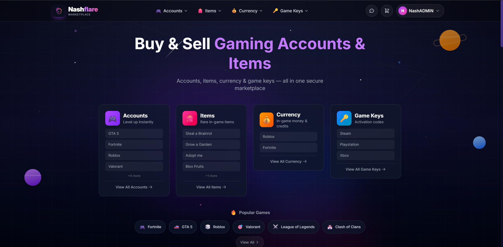

# Nashflare

A full-stack gaming marketplace where users buy and sell gaming accounts, top-ups, and game keys.

🌐 **Live Site:** [nashflare.com](https://nashflare.com)



---

## 🚀 About The Project

Nashflare is a fully functional e-commerce platform I built from scratch for the gaming community. The marketplace connects buyers and sellers, handling everything from user authentication to payment processing and automated delivery.

This project demonstrates my ability to design, develop, and deploy a production-ready full-stack application.

---

## 🛠️ Tech Stack

**Frontend**
- Next.js 14 (App Router)
- React
- TypeScript
- Tailwind CSS
- Responsive Design

**Backend**
- Node.js
- Supabase (PostgreSQL)
- RESTful APIs
- Real-time subscriptions

**Payments & Security**
- Stripe integration
- Two-factor authentication (2FA)
- Secure user authentication

**Deployment & Tools**
- Vercel
- GitHub Actions (CI/CD)
- Git version control

---

## ✨ Key Features

### For Buyers
- Browse and search gaming products
- Secure checkout with Stripe
- Real-time messaging with sellers
- Order history and tracking
- Automated instant delivery

### For Sellers (Vendors)
- Vendor onboarding system
- Product listing management
- Sales dashboard and analytics
- Real-time order notifications
- Payout management

### Admin Dashboard
- User management
- Order oversight
- Vendor approvals
- Platform analytics

---

## 📸 Screenshots

### Homepage


### Product Page


### Vendor Dashboard


### Checkout


---

## 🏗️ Architecture Overview

```
┌─────────────────┐     ┌─────────────────┐     ┌─────────────────┐
│                 │     │                 │     │                 │
│   Next.js App   │────▶│   Supabase      │────▶│   PostgreSQL    │
│   (Frontend +   │     │   (Auth + API)  │     │   (Database)    │
│    API Routes)  │     │                 │     │                 │
│                 │     │                 │     │                 │
└─────────────────┘     └─────────────────┘     └─────────────────┘
         │                                               
         │                                               
         ▼                                               
┌─────────────────┐     ┌─────────────────┐
│                 │     │                 │
│     Stripe      │     │     Vercel      │
│   (Payments)    │     │   (Hosting)     │
│                 │     │                 │
└─────────────────┘     └─────────────────┘
```

---

## 🎯 What I Learned

- Building a complete e-commerce platform from idea to production
- Implementing secure payment processing with Stripe
- Designing database schemas for complex relationships
- Creating real-time features with Supabase subscriptions
- Managing user roles and permissions (buyers, sellers, admins)
- Optimizing performance and SEO for Next.js applications
- CI/CD deployment workflows with GitHub and Vercel

---

## 📬 Contact

**Julian Chapman**

- 📧 Email: julianchapman8@gmail.com
- 🐙 GitHub: [@chapdev](https://github.com/chapdev)

---

*This is a showcase repository. The source code is kept private as Nashflare is an active business.*
